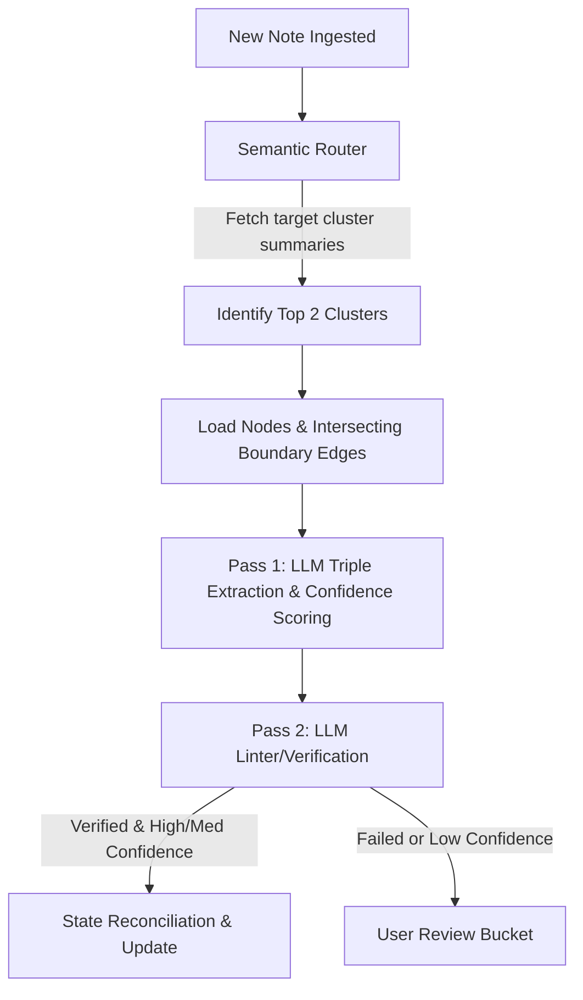

# AI Knowledge Graph Pipeline: Architecture & System Design

This document details the architectural specification for a context-bounded, dynamically-clustering Knowledge Graph system. The system ingests free-form text notes and processes them into structured entities and relationships while maintaining semantic consistency, historical lineage, and automatic conflict resolution.

---

## 1. System Overview & Ingest Pipeline

The ingestion pipeline runs on a single free-form note within a specific `Context ID` (e.g., "Sarah's Info"). Ingestion is optimized to be fast and cost-effective by loading only the relevant local subgraphs rather than the entire context boundary.



### Two-Pass Extraction Pipeline
1. **Pass 1 (Extraction)**: The LLM parses the note and extracts triples in the format `(subject, relation, object)` alongside a confidence score (`High`, `Medium`, `Low`) for each triple.
2. **Pass 2 (Verification)**: A lightweight, specialized LLM checks the output against the raw note to detect hallucinations (facts not present in the note) or critical omissions.
   * **Pass**: The transaction commits silently to the database.
   * **Fail (or Low Confidence)**: The extraction is held in a review draft for the user to quickly confirm.

---

## 2. Ingestion Routing & Multi-Cluster Fallback

When a note is ingested, loading the entire graph is avoided by routing it to specific sub-clusters.

### Semantic Vector Routing
* Every cluster stores a dynamic **Semantic Description/Summary** (e.g., `"Extreme sports and high-adrenaline activities"`).
* The incoming note is embedded using a text-embedding model and compared against the cluster summaries via vector search.
* The system identifies the **top 2 most relevant clusters** to load into the LLM context.

### Shared Node Expansion (The Intersection Rule)
To handle notes spanning multiple clusters without bloating the prompt:
1. The top 2 clusters (e.g., `SPORTS` and `RELATIONSHIPS`) are loaded fully.
2. If a boundary node (e.g., `Bob`) exists in the loaded context and also has connections to an omitted cluster (e.g., `WORK`), the system fetches **only** the edges where `Bob` connects back to nodes already loaded in the active context.
3. Mathematically, the loaded boundary edges are defined as:
   $$\text{Edges} = \{(u, v) \mid (u = \text{BoundaryNode} \land v \in V_{\text{loaded}}) \lor (v = \text{BoundaryNode} \land u \in V_{\text{loaded}})\}$$

---

## 3. Relationship Taxonomy & Conflict Resolution

To distinguish between normal preference changes over time and actual data contradictions, the system categorizes all extracted edges into three taxons:

| Relationship Type | Description | System Behavior |
| :--- | :--- | :--- |
| **Type A: Events/Actions** | Historical events (e.g., `went_hiking`, `bought_boots`). | Cumulative. Appended to the database; never conflicts. |
| **Type B: Preferences** | Temporal preferences (e.g., `favorite_fruit`, `likes`). | Supersedes on change. Old edge set to `active = false` and logged to the changelog. No anomaly flagged. |
| **Type C: States/Attributes** | Structural properties (e.g., `dietary: vegetarian`, `allergic_to: peanuts`). | Contradiction check. If a new state contradicts an existing active state, the update is blocked and flagged as an anomaly. |

### Anomaly Verification & "Nuance" UX
If a **State Contradiction** or a **Velocity Anomaly** (a Type B preference changing $>3$ times within a 24-hour window) is triggered, it is sent to the **Anomaly Review Bucket**.
The UI presents a side-by-side reconciliation screen:
* **The Conflict**: Shows Note A's state vs. Note B's state, along with the timestamps and text source.
* **The Resolution Options**:
  1. **Accept Suggestion**: Update to an AI-inferred nuance (e.g., `vegetarian` + `eats_meat` $\rightarrow$ `flexitarian`).
  2. **Keep Note B**: Overwrite old state with the new state.
  3. **Keep Note A**: Keep old state and discard the contradiction.
  4. **Custom**: Input a custom text state.

---

## 4. Cluster Hierarchy Evolution (Dual Tagging)

As the graph grows, the AI dynamically splits, merges, and renames clusters.

### Dual Tagging Strategy
To maintain history without creating recursive query bottlenecks:
* **`current_cluster_id`**: Points to the active leaf cluster. Used for daily runtime queries.
* **`original_cluster_id`**: Points to the cluster the node was initially assigned to. Immutable, preserving historical timeline logs.
* **Virtual Parent Redirects**: When a cluster splits or merges, the old cluster record is marked `active = false` and stores its `successor_cluster_ids`. This preserves referential integrity for historical nodes without breaking lineage tracking.

---

## 5. Concurrency & Rebalancing Schedule

To keep the UI responsive, operations are split into immediate local tasks and deferred batch routines:

```mermaid
gantt
    title Processing Schedule
    dateFormat  HH:mm
    axisFormat %H:%M
    section Ingestion
    Local Ingest & Triple Save  :active, 00:00, 00:05
    Immediate Router Embedding Sync : 00:05, 00:06
    section Scheduled Tasks
    Daily Cluster Size Check & Split : 01:00, 01:30
    Weekly Global Audit & Deduplication : 02:00, 03:00
```



1. **Immediate (Inline)**:
   * Saves the note and local graph mutations.
   * If a new cluster is created/split, generates its summary and vector embedding immediately to ensure router accuracy.
2. **Daily (Light Rebalancing)**:
   * Scans cluster node counts. If any exceeds the plan cap, the LLM splits it and assigns nodes to new child clusters using a mapping response.
3. **Weekly (Deep Audit)**:
   * Runs global semantic deduplication (vector search matching nodes across the entire context).
   * Runs global anomaly checking.
   * *Paid tier advantage*: Runs nightly or on-demand.
4. **Concurrency Model (Snapshot + Async)**:
   * The rebalancer reads a database snapshot at Time $T$.
   * User note ingestion is **never blocked**. If a user ingests notes during rebalancing, the new nodes sit in the parent cluster and are assigned a newer `rebalance_version` timestamp to be processed in the next cycle.

---

## 6. Database Schema Specification (PostgreSQL + pgvector)

```sql
-- Enums & Extensions
CREATE EXTENSION IF NOT EXISTS pgvector;

CREATE TABLE contexts (
  id UUID PRIMARY KEY DEFAULT gen_random_uuid(),
  user_id UUID NOT NULL,
  name VARCHAR(255) NOT NULL,
  created_at TIMESTAMP DEFAULT CURRENT_TIMESTAMP
);

CREATE TABLE clusters (
  id UUID PRIMARY KEY DEFAULT gen_random_uuid(),
  context_id UUID REFERENCES contexts(id) ON DELETE CASCADE,
  name VARCHAR(255) NOT NULL,
  description TEXT,
  embedding vector(1536), -- Dimension depends on embedding model (e.g. OpenAI/Gemini)
  parent_id UUID REFERENCES clusters(id) ON DELETE SET NULL,
  active BOOLEAN NOT NULL DEFAULT TRUE,
  successor_cluster_ids UUID[] DEFAULT '{}'::uuid[],
  created_at TIMESTAMP DEFAULT CURRENT_TIMESTAMP
);

CREATE TABLE nodes (
  id UUID PRIMARY KEY DEFAULT gen_random_uuid(),
  context_id UUID REFERENCES contexts(id) ON DELETE CASCADE,
  name VARCHAR(255) NOT NULL,
  description TEXT,
  current_cluster_id UUID REFERENCES clusters(id) ON DELETE SET NULL,
  original_cluster_id UUID REFERENCES clusters(id) ON DELETE SET NULL,
  status VARCHAR(50) NOT NULL DEFAULT 'ACTIVE', -- ACTIVE, ARCHIVED, MERGED
  merged_into_node_id UUID REFERENCES nodes(id) ON DELETE SET NULL,
  cluster_history JSONB NOT NULL DEFAULT '[]'::jsonb,
  last_rebalanced_at TIMESTAMP,
  confidence VARCHAR(50) NOT NULL DEFAULT 'HIGH', -- HIGH, MEDIUM, LOW
  created_at TIMESTAMP DEFAULT CURRENT_TIMESTAMP,
  updated_at TIMESTAMP DEFAULT CURRENT_TIMESTAMP
);

CREATE TABLE notes (
  id UUID PRIMARY KEY DEFAULT gen_random_uuid(),
  context_id UUID REFERENCES contexts(id) ON DELETE CASCADE,
  content TEXT NOT NULL,
  created_at TIMESTAMP DEFAULT CURRENT_TIMESTAMP
);

CREATE TABLE extractions (
  id UUID PRIMARY KEY DEFAULT gen_random_uuid(),
  note_id UUID REFERENCES notes(id) ON DELETE CASCADE,
  pass_1_triples JSONB NOT NULL,
  pass_2_lint_result JSONB NOT NULL,
  pass_2_approved BOOLEAN NOT NULL,
  user_confirmed BOOLEAN NOT NULL DEFAULT FALSE,
  created_at TIMESTAMP DEFAULT CURRENT_TIMESTAMP
);

CREATE TABLE edges (
  id UUID PRIMARY KEY DEFAULT gen_random_uuid(),
  context_id UUID REFERENCES contexts(id) ON DELETE CASCADE,
  source_id UUID REFERENCES nodes(id) ON DELETE CASCADE,
  target_id UUID REFERENCES nodes(id) ON DELETE CASCADE,
  relation_type VARCHAR(255) NOT NULL,
  taxonomy_type VARCHAR(50) NOT NULL, -- EVENT, PREFERENCE, STATE
  active BOOLEAN NOT NULL DEFAULT TRUE,
  confidence VARCHAR(50) NOT NULL DEFAULT 'HIGH',
  source_note_id UUID REFERENCES notes(id) ON DELETE SET NULL,
  created_at TIMESTAMP DEFAULT CURRENT_TIMESTAMP,
  updated_at TIMESTAMP DEFAULT CURRENT_TIMESTAMP
);

CREATE TABLE anomalies (
  id UUID PRIMARY KEY DEFAULT gen_random_uuid(),
  context_id UUID REFERENCES contexts(id) ON DELETE CASCADE,
  conflict_type VARCHAR(50) NOT NULL, -- CONTRADICTION, VELOCITY
  offending_node_id UUID REFERENCES nodes(id) ON DELETE CASCADE,
  note_a_id UUID REFERENCES notes(id) ON DELETE SET NULL,
  note_b_id UUID REFERENCES notes(id) ON DELETE SET NULL,
  status VARCHAR(50) NOT NULL DEFAULT 'PENDING', -- PENDING, RESOLVED
  created_at TIMESTAMP DEFAULT CURRENT_TIMESTAMP
);

CREATE TABLE changelog (
  id UUID PRIMARY KEY DEFAULT gen_random_uuid(),
  context_id UUID REFERENCES contexts(id) ON DELETE CASCADE,
  entity_type VARCHAR(50) NOT NULL, -- NODE, EDGE
  entity_id UUID NOT NULL,
  action VARCHAR(50) NOT NULL, -- CREATE, UPDATE, SUPERSEDE, DELETE, MERGE
  previous_value JSONB,
  new_value JSONB,
  reason TEXT,
  note_id UUID REFERENCES notes(id) ON DELETE SET NULL,
  created_at TIMESTAMP DEFAULT CURRENT_TIMESTAMP
);

-- Performance Indexes
CREATE INDEX idx_clusters_embedding ON clusters USING hnsw (embedding vector_cosine_ops);
CREATE INDEX idx_nodes_query ON nodes(context_id, current_cluster_id) WHERE status = 'ACTIVE';
CREATE INDEX idx_edges_source ON edges(source_id) WHERE active = TRUE;
CREATE INDEX idx_edges_target ON edges(target_id) WHERE active = TRUE;
CREATE INDEX idx_anomalies_pending ON anomalies(context_id) WHERE status = 'PENDING';
```
