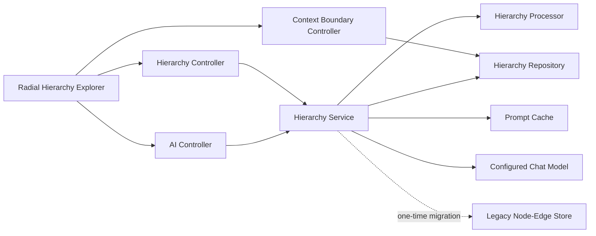
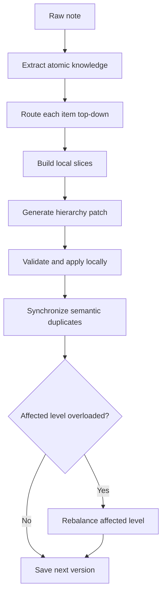

# Knodeledge System Overview

**Status:** Implemented
**Updated:** 2026-06-15

## Purpose

Knodeledge converts free-form notes into an authoritative recursive knowledge hierarchy. Each
context boundary represents one subject or bounded domain. The hierarchy starts with that subject
as its root and becomes more specific at every level.

The system avoids sending all stored knowledge to an LLM. Ingestion and prompting route from the
root through compact child summaries, load only selected paths and immediate children, and operate
on that local context.

## Architecture



Main responsibilities:

- `HierarchyService` performs ingestion, routing, prompting, rebalancing, level reads, and migration.
- `HierarchyProcessor` validates trees and applies local structured patches deterministically.
- `HierarchyRepository` stores one versioned hierarchy per context boundary.
- `BoundaryLockManager` serializes writes for each boundary.
- `CachedPromptExecutor` caches exact successful model responses in memory.
- The web client fetches one hierarchy level at a time and renders it radially.

## Authoritative Model

```text
HierarchyNode {
  id
  semanticKey
  parentId
  kind
  relationToParent
  name
  statement
  summary
}

BoundaryHierarchy {
  boundaryId
  rootNodeId
  nodes
  version
}
```

Node kinds:

| Kind | Purpose |
|---|---|
| `ROOT` | Context-boundary subject |
| `TOPIC` | Organizational branch |
| `ENTITY` | Named person, object, work, place, or concept |
| `FACT` | Precise durable statement |
| `CONDITION` | Qualification attached below a fact or condition |

Every node has a stable ID, semantic key, name, and routing summary. `FACT` and `CONDITION` nodes
also require a precise statement. Every non-root node has one parent and a typed
`UPPER_SNAKE_CASE` relation.

The root is created with the context boundary and cannot be moved, replaced, or deleted.

## Example

```text
Kuku [ROOT]
├─ Profile [TOPIC, CONTAINS]
│  ├─ Person [ENTITY, IS_A]
│  └─ Programmer [FACT, HAS_ROLE]
├─ Interests [TOPIC, CONTAINS]
│  ├─ Music [TOPIC, CONTAINS]
│  │  ├─ Guitar [FACT, PLAYS]
│  │  └─ Makes music [FACT, CREATES]
│  ├─ Anime [TOPIC, CONTAINS]
│  │  ├─ Attack on Titan [FACT, WATCHES]
│  │  └─ Cyberpunk: Edgerunners [FACT, WATCHES]
│  └─ Gaming [TOPIC, CONTAINS]
│     ├─ Rainbow Six Siege [FACT, PLAYS]
│     ├─ Game Development [FACT, LIKES]
│     └─ Conditional game preference [FACT, HAS_PREFERENCE]
│        ├─ Manageable by Kuku [CONDITION, ALL_OF]
│        └─ Has NPC village [CONDITION, ALL_OF]
└─ Behaviour & State [TOPIC, CONTAINS]
   ├─ Does not get angry easily [FACT, HAS_TRAIT]
   └─ Gets tipsy [FACT, HAS_STATE]
      └─ When drinking alcohol [CONDITION, WHEN]
```

## Context Boundaries

Creating a context boundary creates and validates its hierarchy root in the same request. The
boundary name becomes the root name. The boundary description becomes its initial summary.

Boundary access always checks the requesting user ID before hierarchy data is read or changed.

## Ingestion



Ingestion uses these stages:

1. Extract precise knowledge items, nested conditions, semantic keys, names, and summaries.
2. Route each top-level item through names and summaries with beam width two.
3. Build a local slice containing selected paths, immediate children, and matching semantic copies.
4. Ask the model for structured additions, semantic updates, moves, deletes, and ancestor summaries.
5. Apply the patch against the complete hierarchy in server memory.
6. Reject changes outside routed slices.
7. Synchronize all placements sharing an updated or deleted semantic key.
8. Rebalance affected levels with more than twelve children when semantic grouping is useful.
9. Validate the complete result and save one new hierarchy version.

The model never directly persists data. The deterministic processor owns IDs, validation, mutation,
and version increments.

## Prompting

Prompting uses the same top-down router. At each step, the model receives:

- selected current nodes
- immediate candidate children
- names, kinds, relations, and summaries

The router can stop at an internal node for a broad question. Precise questions continue toward
facts and conditions. The answer prompt receives selected nodes and their root-to-node paths.

After one-time legacy migration, no steady-state prompt receives the complete hierarchy.

## Continuous Rebalancing

Levels may contain as many children as the knowledge requires. A level with more than twelve
children becomes a rebalance candidate.

Rebalancing:

- inspects one overloaded level only
- may create coherent topic nodes
- may move existing children below those topics
- never deletes knowledge
- refreshes summaries through the root
- leaves already coherent levels unchanged

The processor allows depth up to 32 as a technical runaway guard. Product prompts prefer useful
progressive depth rather than shallow flat lists.

## Semantic Duplicates

One fact may appear in multiple branches. Each placement has its own node ID and parent but shares
a semantic key.

When semantic content changes:

- all matching placements receive the same kind, name, statement, and summary
- placement-specific parent and relation remain intact
- all affected ancestor paths require fresh summaries
- deletion removes every matching placement transactionally

Validation rejects semantic copies with inconsistent content.

## Conditions

Conditions are hierarchy nodes, not free-form metadata. They can nest below facts or other
conditions.

Core relations:

- `WHEN` for triggering context
- `ALL_OF` for conjunction
- `ANY_OF` for alternatives
- `NOT` for negation

Precise statements preserve subject, predicate, object, degree, frequency, and negation.

## Validation

`HierarchyProcessor` rejects:

- missing boundary or root IDs
- empty hierarchies
- duplicate node IDs
- multiple roots or invalid root kind
- missing parents
- parent cycles
- depth greater than 32
- blank IDs, semantic keys, names, or summaries
- blank fact or condition statements
- relations not matching `UPPER_SNAKE_CASE`
- inconsistent semantic copies
- root deletion, movement, or semantic replacement
- updates, moves, additions, or deletes outside routed local context
- missing ancestor summary refreshes

All validation finishes before repository save.

## Concurrency and Storage

Storage is in memory for the current release. Each hierarchy is stored as one immutable versioned
value.

`BoundaryLockManager` uses a reentrant lock per boundary. Concurrent ingestion and prompt requests
for different boundaries can proceed independently. Requests changing the same boundary are
serialized to prevent lost updates.

## Prompt Response Cache

Every model call goes through `CachedPromptExecutor`. Cache identity includes:

- model name
- pipeline stage
- expected response type
- complete system prompt
- complete user prompt

Only exact successful calls are reused. Concurrent identical misses share one provider call.
Failures and blank responses are not retained.

| Property | Environment variable | Default |
|---|---|---|
| `knodeledge.ai.prompt-cache.enabled` | `PROMPT_CACHE_ENABLED` | `true` |
| `knodeledge.ai.prompt-cache.max-entries` | `PROMPT_CACHE_MAX_ENTRIES` | `1000` |

The cache uses bounded FIFO eviction and is cleared on process restart.

## Legacy Migration

The retired node-edge repository is retained only as a migration input.

When a boundary has no hierarchy but has legacy data:

1. Load the legacy snapshot once.
2. Send that snapshot with boundary metadata to the migration prompt.
3. Validate the returned hierarchy.
4. Save hierarchy version one.
5. Use only hierarchy storage afterward.

New writes never update the legacy store.

## HTTP API

| Method | Path | Purpose |
|---|---|---|
| `POST` | `/api/v1/auth/register` | Register user |
| `POST` | `/api/v1/auth/login` | Authenticate user |
| `POST` | `/api/v1/context-boundary/?userId=...` | Create boundary and root |
| `GET` | `/api/v1/context-boundary/user/{userId}` | List user boundaries |
| `POST` | `/api/v1/aiService/ingest` | Ingest note |
| `POST` | `/api/v1/aiService/prompt` | Ask hierarchy |
| `GET` | `/api/v1/hierarchy/{boundaryId}/level?userId=...&nodeId=...` | Read one level |
| `GET` | `/api/v1/hierarchy/debug/{boundaryId}?userId=...` | Export full hierarchy for debugging |

The level response contains:

```text
HierarchyLevelResponse {
  current
  children
  breadcrumbs
  leaf
  hierarchyVersion
}
```

Omitting `nodeId` loads the root level.

## Frontend

The web client displays one level at a time:

- current node fixed at center
- immediate children arranged radially
- typed relations shown on edges
- child click loads that child as the next center
- breadcrumbs and back button load ancestors
- inspector shows summary and exact statement
- leaf panel shows final detailed knowledge

Normal exploration never downloads the full hierarchy. Full export is available only in Debug.

## Verification

Run backend tests:

```bash
cd knodeledge-spring
mvn test
```

Run frontend checks:

```bash
cd web-dev
npm run lint
npm run build
```

## Related Documentation

1. [Hierarchy architecture](2.hierarchy_design/2.1.hierarchy_architecture.md)
2. [Prompt engineering rules](3.ai_pipeline/3.1.prompt_engineering_rules.md)
