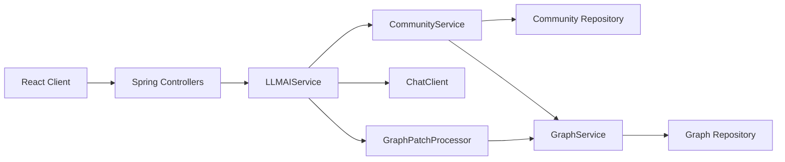
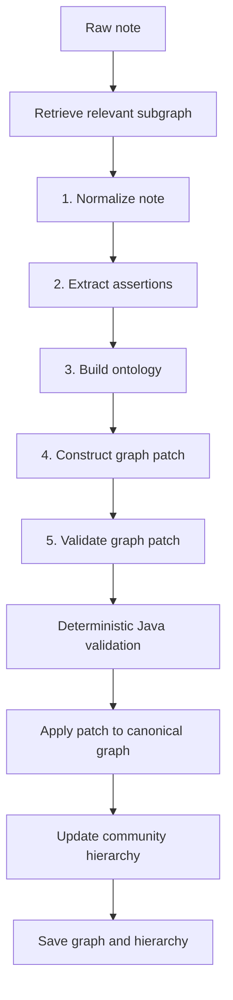

# Knodeledge Backend System Overview

**Status:** Implemented  
**Updated:** 2026-06-15

## Purpose

Knodeledge converts free-form notes into a context-bounded knowledge graph. Each context
boundary belongs to one user and contains a canonical set of nodes and directed edges.

The backend provides:

- user registration and login
- context-boundary creation and lookup
- note ingestion through a five-stage LLM pipeline
- deterministic graph validation and patch application
- recursive community-based graph retrieval
- graph-grounded question answering
- debug APIs for graph, hierarchy, and retrieval inspection

## Architecture



All repositories are currently in-memory. Restarting the backend clears users, context
boundaries, canonical graphs, and community hierarchies.

## Canonical Graph

The canonical graph is the source of truth. A node contains:

| Field | Meaning |
|---|---|
| `id` | Stable canonical identifier |
| `label` | Human-readable name |
| `categories` | Cache of direct taxonomy targets |
| `description` | Concise semantic description |

An edge contains:

| Field | Meaning |
|---|---|
| `source` | Source node ID |
| `target` | Target node ID |
| `predicate` | Directed semantic relationship |
| `context` | Source fact or provenance text |

Categories remain traversable graph data. Every category ID must exist as a node and have a
matching `INSTANCE_OF`, `HAS_GENRE`, or `GRAPH_ROLE` edge. Qualified facts use statement
subgraphs documented in
[2.1.conditional_facts.md](2.graph_design/2.1.conditional_facts.md).

## Note Ingestion

`POST /api/v1/aiService/ingest` accepts a note, context-boundary ID, and actor ID.



The LLM stages receive only the retrieved graph after hierarchy bootstrap. The complete
canonical graph remains server-side and is used when applying the validated local patch, so
unrelated nodes and edges are preserved.

Graph mutation is rejected when:

- node or edge fields are empty
- an edge references a missing node
- a category cache lacks its taxonomy edge
- structural condition graphs are incomplete or cyclic
- placeholder or vague predicates are used
- the patch deletes data outside the retrieved graph
- the final graph contains isolated or invalid structural nodes

## Hierarchical Retrieval

The retrieval hierarchy is an index over the canonical graph, not a second graph truth.
Communities may overlap: one canonical node or edge can belong to multiple communities.

Each community stores:

- `id`, `name`, and routing `summary`
- optional `parentId`
- canonical `memberNodeIds`
- canonical `memberEdges` as `(source, target, predicate)` references

The hierarchy is created lazily on the first ingest, prompt, or hierarchy debug request. A
non-empty existing graph is sent once to the hierarchy bootstrap prompt. An empty graph starts
with one root community.

Steady-state routing walks the hierarchy recursively:

1. Start from root communities.
2. Ask the LLM to score candidate summaries.
3. Keep at most two valid candidates.
4. Continue through their children until selected branches reach leaves.
5. Build one retrieved graph from the selected communities.

Retrieval expands community membership with:

- direct one-hop neighbors
- complete taxonomy/category closure
- complete statement, condition-group, and condition structures

Hierarchy validation requires:

- unique non-empty community IDs, names, and summaries
- at least one root
- valid parent references
- no parent cycles
- maximum depth of six levels
- valid canonical node and edge references
- complete membership coverage for every canonical node and edge

After ingestion, changed elements are assigned to selected communities or a newly created child.
Summaries are refreshed for affected communities and every ancestor. Deleted graph elements are
removed from community membership. Graph and hierarchy validation complete before either is
saved.

Full behavior and examples are documented in
[2.2.hierarchical_retrieval.md](2.graph_design/2.2.hierarchical_retrieval.md).

## Graph Prompting

`POST /api/v1/aiService/prompt` uses the same hierarchy router as ingestion. The answer prompt
receives only the retrieved graph and must:

- use graph data only
- distinguish conditional from unconditional facts
- avoid outside knowledge
- return `"I don't know from this graph."` when evidence is absent

## Concurrency

Ingestion, graph prompting, hierarchy bootstrap, and hierarchy retrieval use a per-boundary
reentrant lock. Concurrent work on different boundaries can proceed independently. Operations
for the same boundary are serialized to prevent lost graph or hierarchy updates.

## HTTP API

| Method | Path | Purpose |
|---|---|---|
| `POST` | `/api/v1/auth/register` | Register user |
| `POST` | `/api/v1/auth/login` | Authenticate user |
| `POST` | `/api/v1/context-boundary/?userId=...` | Create boundary |
| `GET` | `/api/v1/context-boundary/user/{userId}` | List user boundaries |
| `POST` | `/api/v1/aiService/ingest` | Ingest note |
| `POST` | `/api/v1/aiService/prompt` | Ask retrieved graph |
| `GET` | `/api/v1/graph/{boundaryId}?userId=...` | Read canonical graph |
| `GET` | `/api/v1/graph/debug/all` | Inspect all stored graphs |
| `GET` | `/api/v1/graph/debug/{boundaryId}/hierarchy?userId=...` | Inspect hierarchy |
| `POST` | `/api/v1/graph/debug/{boundaryId}/retrieve` | Inspect routing and retrieved graph |

The retrieval debug request body is:

```json
{
  "query": "What games does Kuku enjoy?",
  "userId": "user-id"
}
```

Its response contains selected community IDs, every routing step, and the final retrieved graph.

## Current Boundaries

- Persistence is in-memory only.
- Routing uses the configured chat model; no embeddings or vector database are present.
- Hierarchy rebalancing, merge/split jobs, and empty-community cleanup are not implemented.
- Community hierarchy is exposed through debug APIs only; the frontend has no hierarchy browser.
- LLM provider-backed behavior depends on `OPENAI_API_KEY`, `OPENAI_BASE_URL`, and
  `OPENAI_MODEL`.

## Related Documentation

1. [Conditional facts](2.graph_design/2.1.conditional_facts.md)
2. [Hierarchical retrieval](2.graph_design/2.2.hierarchical_retrieval.md)
3. [Prompt engineering rules](3.ai_pipeline/3.1.prompt_engineering_rules.md)
