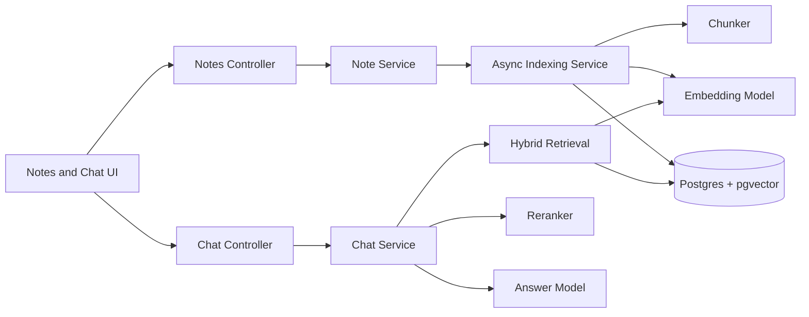

# Knodeledge System Overview

**Status:** Implemented v1
**Updated:** 2026-06-16

## Purpose

Knodeledge stores raw personal notes and answers questions from those notes only. The v1 product
does not ask users to create folders, domains, graphs, entities, or schemas. The original note text
is the source of truth; derived chunks and indexes can be deleted and rebuilt at any time.

## Architecture



The backend is a Spring Boot application using JDBC, Flyway, Spring AI, Postgres full-text search,
and pgvector. The frontend is a Vite React app focused on note editing and cited chat answers.

## Core Data

`notes` stores the raw note content, user ownership, soft delete state, and index status. `note_chunks`
stores derived chunk text, embeddings, generated `tsvector` search text, and chunk metadata.

Each table that can expose note content includes `user_id`. Every note, chunk, dense search, sparse
search, and chat query is scoped to the authenticated user.

## User Flow

1. A user registers or logs in.
2. The frontend sends the returned user id as a bearer token.
3. The user creates or edits a raw note.
4. The API saves the note immediately as `pending`.
5. A background job chunks, embeds, and indexes the note.
6. The user asks a question.
7. The backend retrieves candidate chunks, reranks them, and asks the answer model to respond only
   from retrieved context.
8. The response includes citations or a not-enough-info answer.

## Verification

Backend:

```bash
cd knodeledge-spring
mvn test
```

Frontend:

```bash
cd web-dev
npm run lint
npm run build
```
