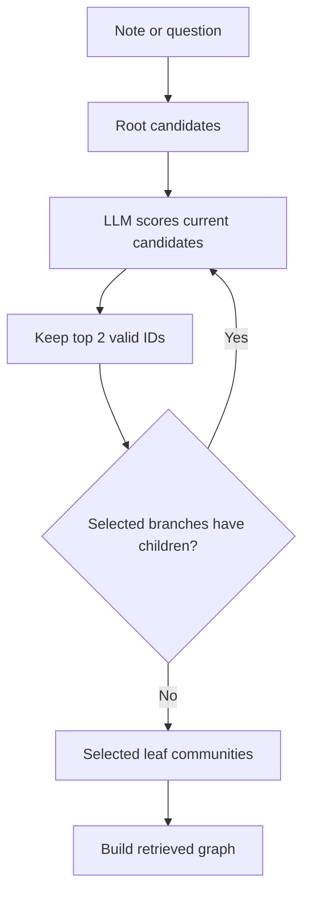

# Hierarchical Graph Retrieval

**Status:** Implemented MVP  
**Updated:** 2026-06-15  
**Area:** Knowledge Graph / Context Retrieval

## Problem

Sending an entire growing graph to an LLM has two scaling failures:

1. The graph eventually exceeds model context limits.
2. Relevant facts receive less attention as unrelated graph content grows.

Knodeledge addresses this with a recursive community hierarchy. The canonical graph remains the
source of truth. Communities provide compact routing summaries and membership references used to
select a local subgraph.

## Data Model

```json
{
  "id": "community_interests_gaming",
  "name": "Gaming",
  "summary": "Games Kuku plays, game-development interests, and game preferences.",
  "parentId": "community_interests",
  "memberNodeIds": [
    "kuku",
    "gaming",
    "rainbow_six_siege"
  ],
  "memberEdges": [
    {
      "source": "kuku",
      "target": "rainbow_six_siege",
      "predicate": "ENJOYS_PLAYING"
    }
  ]
}
```

Membership is many-to-many. Shared entities such as `kuku` may appear in gaming, music, anime,
and profile communities without duplicating the canonical node.

Communities do not own graph entities and do not change graph semantics. Their node IDs and edge
references must resolve against the canonical graph.

## Example Hierarchy

```text
Kuku Knowledge
├── Profile
│   ├── Identity
│   └── Occupation
├── Interests
│   ├── Music
│   ├── Anime
│   └── Gaming
│       ├── Played Games
│       └── Game Preferences
└── Behaviour and State
    ├── Emotional State
    └── Alcohol Effects
```

This tree may reach six levels including the root. The implementation supports multiple roots,
although hierarchy-generation prompts require one root for normal bootstrap output.

## Lazy Bootstrap

Each boundary receives a hierarchy when retrieval first needs one.

### Existing Graph

The bootstrap prompt receives boundary metadata and the complete canonical graph. It returns a
recursive hierarchy with complete node and edge membership. This is the only expected full-graph
LLM operation.

### Empty Graph

No LLM bootstrap call is needed. The service creates:

```json
{
  "id": "community_root",
  "name": "<Boundary Name> Knowledge",
  "summary": "Root community for <Boundary Name>.",
  "parentId": null,
  "memberNodeIds": [],
  "memberEdges": []
}
```

The hierarchy is stored in `InMemoryCommunityRepository`.

## Top-Down Routing

Routing uses community summaries rather than graph contents.



At each level:

- candidates expose only `id`, `name`, and `summary`
- the router may choose at most two candidates
- hallucinated IDs are discarded
- choices are sorted by score
- routing fails if no valid candidate remains

The response records each candidate set and selected set as `routingPath`, making decisions
inspectable through the debug API.

## Retrieved Graph Construction

Selected community members form the initial seed.

### One-Hop Expansion

Any edge touching a seed node is included, along with both endpoints. This preserves direct
cross-community relationships without loading every neighboring community.

### Taxonomy Closure

The retriever repeatedly follows:

- `INSTANCE_OF`
- `HAS_GENRE`
- `SUBCATEGORY_OF`
- `GRAPH_ROLE`

It also follows every node's cached `categories` IDs. Expansion continues until no new taxonomy
node or edge is found.

### Conditional Structure Closure

If retrieval encounters a statement, condition group, or condition node, the full structural
subgraph is included. Relevant predicates include:

- `STATEMENT_SUBJECT`
- `WHEN`
- `ALL_OF`
- `ANY_OF`
- `NOT`
- `CONDITION_SUBJECT`
- the statement or condition's semantic predicate

This prevents an LLM from receiving only half of a qualified fact.

## Ingestion Integration

The retrieved graph replaces the full graph in ontology resolution, patch construction, and
patch validation prompts.

The final patch is still applied against the full canonical graph:

```text
retrieved graph + note -> local validated patch
full canonical graph + local patch -> next canonical graph
```

This preserves unrelated data. A deterministic delete guard rejects node or edge deletion unless
that element appeared in the retrieved graph.

## Hierarchy Maintenance

After graph validation:

1. Remove deleted nodes and edges from all memberships.
2. Assign every upserted node and edge to at least one community.
3. Allow the LLM to create a child for a genuinely new topic.
4. Refresh summaries for assigned or deletion-affected communities.
5. Refresh every ancestor summary.
6. Validate the complete hierarchy against the next canonical graph.
7. Save graph and hierarchy.

If the LLM returns no assignments for changed elements, the processor assigns them to the
selected communities. It still requires summary updates for those communities and ancestors.

## Validation Invariants

`CommunityHierarchyProcessor` rejects:

- null or empty hierarchies
- blank community IDs, names, or summaries
- duplicate IDs
- missing parent IDs
- parent cycles
- depth greater than six
- missing canonical node or edge references
- canonical nodes or edges absent from all communities
- updates that leave changed graph elements unassigned
- updates that omit required ancestor summaries

## Concurrency and Atomicity

`BoundaryLockManager` serializes operations by context-boundary ID. Reentrant locking permits
the AI service to call community operations while already holding the same boundary lock.

Graph and hierarchy candidates are fully validated before persistence. The current repositories
perform separate in-memory saves while the boundary lock is held.

## Debugging

### Inspect Hierarchy

```http
GET /api/v1/graph/debug/{boundaryId}/hierarchy?userId={userId}
```

This lazily bootstraps the hierarchy when missing.

### Inspect Retrieval

```http
POST /api/v1/graph/debug/{boundaryId}/retrieve
Content-Type: application/json

{
  "query": "What anime does Kuku watch?",
  "userId": "user-id"
}
```

Response:

```json
{
  "selectedCommunityIds": ["community_interests_anime"],
  "routingPath": [
    {
      "candidateCommunityIds": ["community_root"],
      "selectedCommunityIds": ["community_root"]
    },
    {
      "candidateCommunityIds": [
        "community_profile",
        "community_interests",
        "community_behaviour"
      ],
      "selectedCommunityIds": ["community_interests"]
    }
  ],
  "graph": {
    "nodes": [],
    "edges": []
  }
}
```

## Tests

Deterministic tests cover:

- hierarchy cycles and maximum depth
- complete graph membership
- beam-width route selection and invalid route IDs
- one-hop, taxonomy, and conditional closure
- creation of child communities
- ancestor summary propagation
- local patch preservation of unrelated graph data
- rejection of deletes outside retrieval

Run:

```bash
cd knodeledge-spring
mvn test
```

## Known Limitations

- Community storage is in-memory.
- Routing is LLM-based and adds latency/cost at each traversed level.
- No embedding fallback exists.
- No periodic hierarchy rebalance or empty-community cleanup exists.
- Bootstrap still requires one full-graph LLM call.
- Debug endpoints are not intended as a stable public API.
